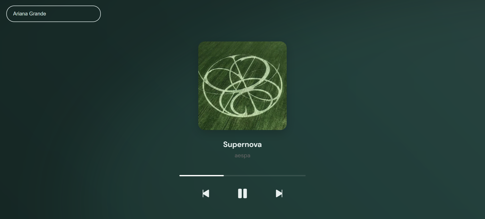
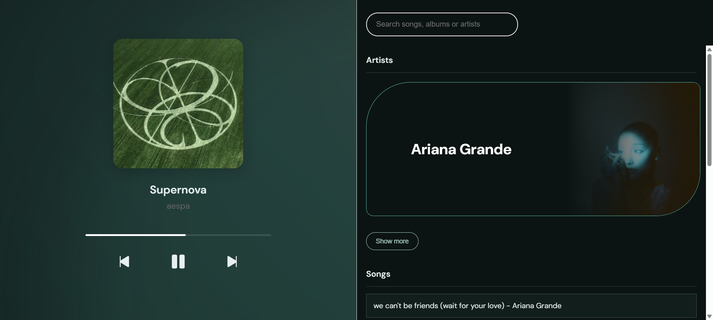
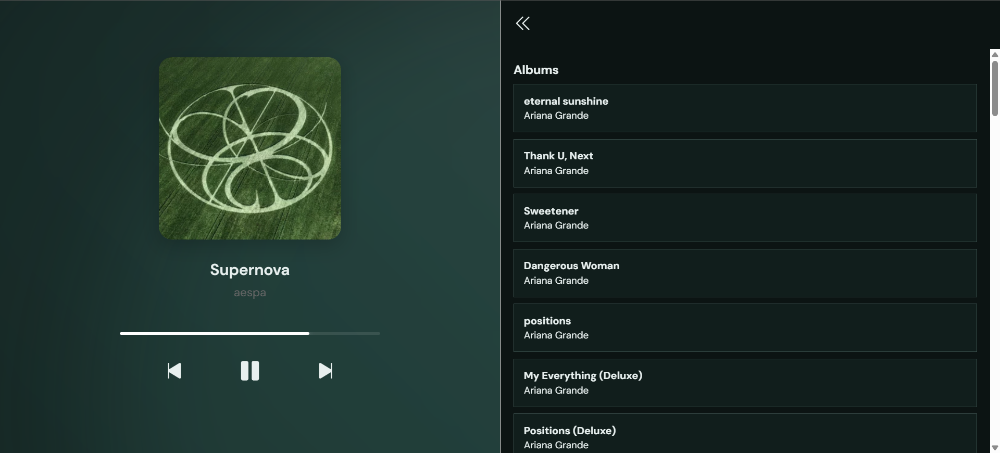
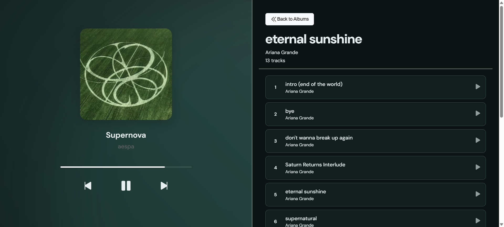

# 🎧 Mix-Play
A sleek, modern music player that integrates the Last.fm API for music discovery with YouTube's video streaming to provide seamless audio playback.  Search for songs, artists, and albums, then play them instantly through an intuitive web interface.

## ✨ Features

* Multi-API Integration: Uses Last.fm for music metadata and YouTube for audio streaming
* Smart Search: Search across songs, artists, and albums with detailed results
* Album Exploration: Browse full album tracklists and play individual tracks
* Playback Queue: Build and navigate through your music queue
* Progress Tracking: Real-time progress bar with smooth animations
* Responsive Design: Beautiful interface that works on all devices
* Artist Discovery: View top artists with rich visual cards and images
* Animated Background: Dynamic gradient animations for an immersive experience

<<<<<<< HEAD
## Project Structure
=======
## 📁 Project Structure
>>>>>>> 2bfd30cbae092341beaa51aa8429439970fa26e6
```
Mix-Play/
├── index.html          # Main HTML structure and YouTube API setup
├── index.css           # Complete styling with animations and responsive design
├── index.js            # Core JavaScript functionality and API integration
├── README.md           # Project documentation
<<<<<<< HEAD
└── preview/            # images of the project
```

## Preview

 
 
 
 

## Technologies Used
=======
└── Preview/            # images of the project
```

## 🛠️ Technologies Used
>>>>>>> 2bfd30cbae092341beaa51aa8429439970fa26e6

* HTML5: Semantic structure and YouTube iframe API integration
* CSS3: Modern styling with animations, gradients, and responsive design
* Vanilla JavaScript: Core functionality and API interactions
* Last.fm API: Music metadata, search, and artist information
* YouTube API: Video search and embedded player for audio streaming

## 🔐 API Configuration

### Last.fm API Usage
* Track Search: `track.search` method
* Artist Search: `artist.search` method
* Album Search: `album.search` method
* Track Info: `track.getInfo` for detailed metadata
* Album Info: `album.getInfo` for tracklists

### YouTube API Usage
* Video Search: Search for audio content
* Iframe Player: Embedded player for streaming
* Channel Data: Artist images and thumbnails

## 📷 Preview

 
 
 
 
